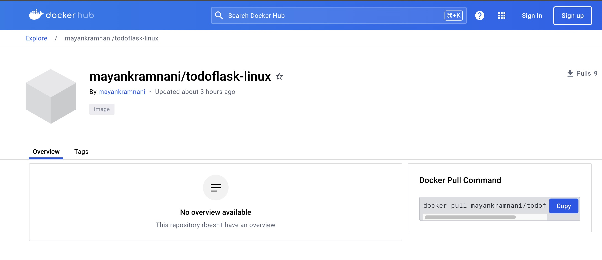

# Cloud Computing - Assignment 2  - Cloud ToDo App
## Part 1 - Creating the application
- Frontend: HTML, CSS, JS
- Backend: Flask
- Database: MongoDB
- Install python dependencies for application (to run flask, to connect with mongodb instance)
- 


## Part 2 - Dockerize the application
- Create [Dockerfile](app/Dockerfile)
- Build and push the docker image to Dockerhub
	+ `docker build -t mayankramnani/todoflask-linux:latest .`
	+ `docker login -u mayankramnani`
	+ `docker push mayankramnani/todoflask-linux:latest`
- 	
- Create [docker-compose.yml](docker-compose.yml) to deploy both flask app and mongodb at once


## Part 3 - Deploy application on Minikube
- Create [deployment.yml](deployment.yml) - Kubernetes deployment for the application that uses my todo flask and mongodb image from Dockerhub
- Create NodePort service to expose the application externally
- Run the application in a browser using minikube
- 
- 


## Part 4 - Deploy application on GKE
- Create a GKE Project: Cloud Computing Todo
- Create a cluster: `cloud-todo`
- Install `gcloud` binary
- Install kubectl plugins to talk to GKE: `gcloud components install gke-gcloud-auth-plugin`
- Configure kubectl to talk to the right cluster: `gcloud container clusters get-credentials cloud-todo --region=us-east1`
- Use the same [deployment.yml](deployment.yml) created above to create deployment in GKE cluster: `kubectl apply -f deployment.yaml`
- Add ingress firewall rule to allow access from the internet using instructions in [link](https://cloud.google.com/kubernetes-engine/docs/how-to/exposing-apps#console_1)
- Access application using a node's IP (`kubectl get nodes -o wide`) and configured NodePort
- 


## Part 5 - Test Replication Controller 
- In [deployment.yml](deployment.yml) file, change the values of spec.replicas to scale up or down the number of desired pods
- run `kubectl apply -f deployment.yml`
- 


## Part 6 - Implement Rolling updates
- In [deployment.yml](deployment.yml) file, define livenessProbe and readinessProbe with these endpoints respectively. 
- Set initialDelaySeconds (the delay in first probe), periodSeconds (frequency to perform probe) and failureThreshold (retry probe this many times, if retries also fail then restart the pod)
- set rolling strategy `spec.strategy.type: RollingUpdate`
- In the [deployment.yml](deployment.yml) file, we specified maxSurge:0 and maxUnavailble:2. Means there will be 0 number of pod which will be created over the desired number of pods and 2 pods can be made unavailble in order to create 2 more pods with new config.
- 
- We can list out all the revisions for this deployment `kubectl rollout history deployment/mytodo-app-deployment`
- To rollback to the previous revision `kubectl rollout undo deployment/mytodo-app-deployment --to-revision=1`
- 

## Part 7 - Implement Health Monitoring
- Create GET `/health` endpoint to check if the application is live
- Create GET `/ready` endpoints to check if the application is receiving the traffic
- Add configuration for liveness and readiness probes and set `httpGet` to above endpoints.
- `initialDelaySeconds: 5` (delay to the first probe after the container starts)
- `periodSeconds: 5` (the probe frequency)
- `failureThreshold: 2` (calls probe 2 times, after 2 fails, kubernetes restarts the pod)
- 
- 

## Part 8 - Implement Alerts using Prometheus and Slack
- Add the Prometheus community repository and install Kube-Prometheus
```
	helm repo add prometheus-community https://prometheus-community.github.io/helm-charts 
	helm repo update
	helm install kube-prometheus prometheus-community/kube-prometheus-stack
```

- In  file, setup Prometheus client library which exposes metrics at the /metrics endpoint
- add monitoring labels to deployment and service in kubernetes in [deployment.yml](deployment.yml) file
- With Kube-Prometheus, additional Custom Resource Definitions (CRDs) are installed, namely PodMonitor and ServiceMonitor. These CRDs inform the Prometheus operator which pods or services to monitor by scraping metrics.
- These CRDs enable you to specify pods or services for monitoring based on certain labels within a defined namespace. Prometheus then picks up these configurations and begins monitoring.
- create a new `PodMonitor` and specify which pods/services to monitor by matching the labels created earlier.
- define custom prometheus rules to send alert using PrometheusRule in kubernetes in [deployment.yml](deployment.yml) file
- For this app, we set `sum(up{container="mytodo-app"}) < 2`, means send alert if total number of pods is 2.
- Specify slack webhook url in [values.yaml](values.yaml) file
- Define Alertmanager configuration and set slackConfig, route, receivers, matchers, etc.
- To test, scale down the pods to 1 `kubectl scale deployments.apps mytodo-app-deployment --replicas=1`
- 
- 
- 

- To setup prometheus, alert-manager and slack integration, follow this [medium-article](https://medium.com/@joudwawad/comprehensive-beginners-guide-to-kube-prometheus-in-kubernetes-monitoring-alerts-integration-4ade4fa8fa8c)

---
Implemented by Mayank Ramnani, Abhay Garg


v4 - old image for rolling
v5 - correct image
v6 - no health
v7 - no ready